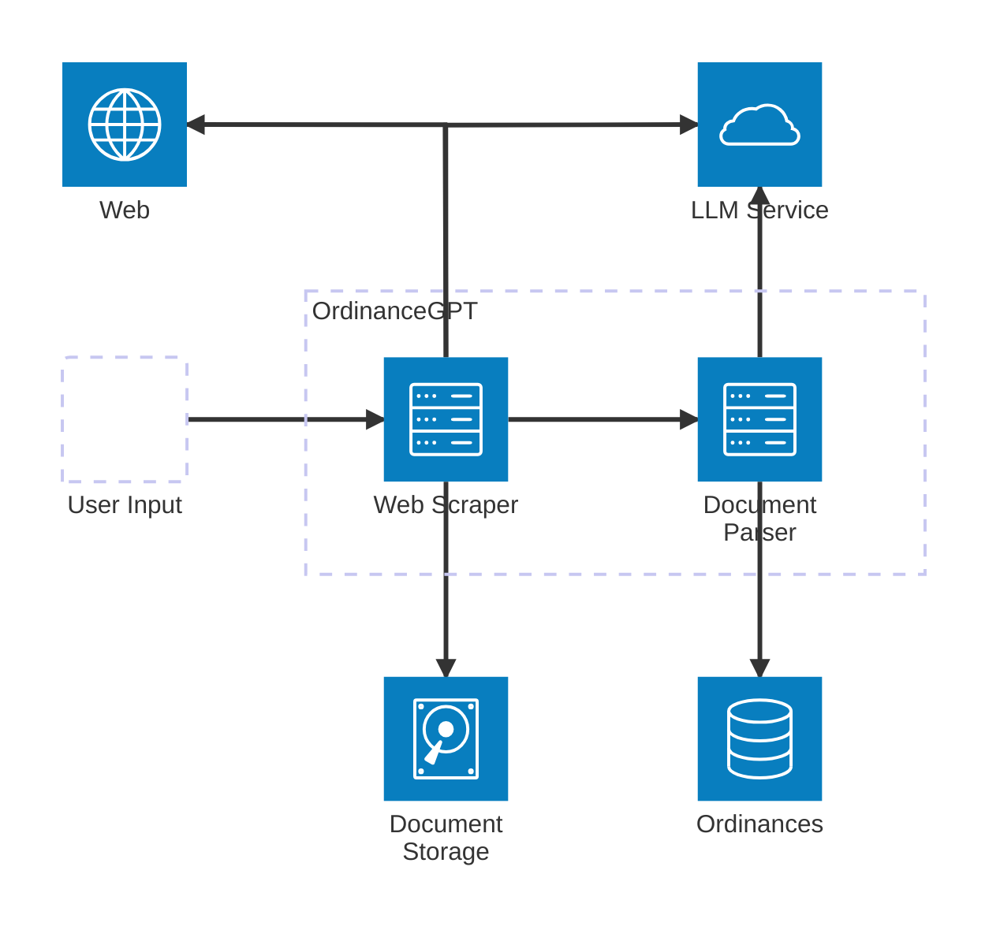
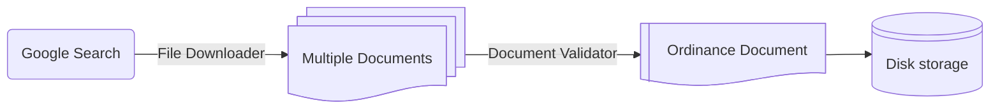
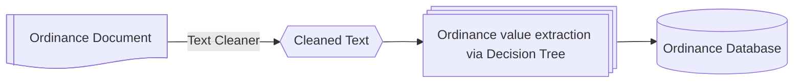

# **OrdinanceGPT: Architectural Design Document**

## **1. Introduction**
### **1.1 Purpose**
This document describes the architectural design of the ordinance web scraping and extraction tool, focusing on its components, key classes, and their roles within the system.

### **1.2 Audience**
- **Primary:** Model developers working on expanding the capabilities of ordinance extraction.
- **Secondary:** Model developers extending this functionality to other contexts.

### **1.3 Scope**
Covers the backend API design, including key classes, their responsibilities, and interactions.

---

## **2. High-Level Architecture**
### **2.1 System Context**
Points of interaction for OrdinanceGPT:
- **End Users:** Users submit model executions via command line using a configuration file. Users can select specific jurisdictions to focus on.
- **Internet via Web Browser:** The model searches the web for relevant legal documents. The most common search technique is Google Search.
- **LLMs:** The model relies on LLMs (typically ChatGPT) to analyze web scraping results and subsequently extract information from documents.
- **Filesystem:** Stores output files in organized sub-directories and compiles ordinance information into a CSV.

**Diagram:**


---

## **3. Detailed Design**
### **3.1 Web Scraper**
The OrdinanceGPT Web Scraper consists of:
- **Google Search:** Searches Google using pre-determined queries.
- **File Downloader:** Converts Google Search results into documents (PDF or text).
- **Document Validators:** Filters out irrelevant documents.

**Diagram:**


### **3.2 Document Parser**
The OrdinanceGPT Document Parser consists of:
- **Text Cleaner:** Extract text from ordinance related to data of interest (i.e. wind turbine zoning).
- **Decision Tree:** One decision tree per ordinance value of interest to guide data extraction using LLMs.

**Diagram:**


---


## **4 Key Concepts and Classes**
### **4.1 Key Concept: Services**
Because OrdinanceGPT is so reliant on LLMs, one of the main design goals is to minimize the code
overhead incurred by querying the LLM API. In other words, we want to make it **as simple as possible**
to make an LLM query from _anywhere_ in the model code. Let's look at the code required to do a single OpenAI
query:
```python
import os
from openai import OpenAI


def my_function():

    ...

    client = OpenAI(
        api_key=os.environ.get("OPENAI_API_KEY"),
        version=os.environ.get("OPENAI_VERSION"),
        endpoint=os.environ.get("OPENAI_ENDPOINT"),
    )

    chat_completion = client.chat.completions.create(
        messages=[
            {
                "role": "user",
                "content": "Say this is a test",
            }
        ],
        model="gpt-4o",
    )

    if response is None:
        response_str = ""
    else:
        response_str = response.choices[0].message.content

    ...


if __name__ == "__main__":
    my_function()
```

Not bad! However, it's still _A LOT_ of boilerplate code every time you want to make query.
Moreover, you may want to do extra processing on the response every time a call is made (i.e.
convert it to JSON, track the number of tokens used, etc). One option is to refactor away
some of the logic into a separate function:


```python
import os
from openai import OpenAI


def count_token_use(response):
    ...


def parse_response_to_str(response):
    if response is None:
        return ""
    return response.choices[0].message.content


def call_openai(messages, model="gpt-4o"):
    client = OpenAI(
        api_key=os.environ.get("OPENAI_API_KEY"),
        version=os.environ.get("OPENAI_VERSION"),
        endpoint=os.environ.get("OPENAI_ENDPOINT"),
    )
    chat_completion = client.chat.completions.create(
        messages=messages, model=model
    )
    count_token_use(response)
    return parse_response_to_str(response)


def my_function():
    ...
    response_str = call_openai(
        messages=[{"role": "user", "content": "Say this is a test"}],
        model="gpt-4o"
    )
    ...


if __name__ == "__main__":
    my_function()
```

This is a lot closer to what we are looking for. However, all LLM deployments (that we know
of anyways!) have quotas and rate limits. It can be frustrating to run into an unexpected rate
limit error deep within our model logic, so we'd like to add a tracker for usage that
staggers the submission of our queries to stay within the pre-imposed rate limits.

To do this, we need to submit our LLM call to a _queue_ instead of to the API directly. Then,
a separate worker can simultaneously monitor the queue and track token usage. If the worker finds
an item in the queue, it will submit the LLM call to the API as long as the rate limit has not
been reached. Otherwise, it will wait until the limit has been reset before submitting an
additional call.

This is the main concept behind _services_ in the ELM ordinance code. We call the worker a
`Service`, and it monitors a dedicated queue that we can submit to from _anywhere_ in our code
without having to worry about setting up usage monitors or other utility functions related to
the API call. The price we have to pay is that the service has to be _running_ (i.e. actively
monitoring a queue and tracking usage) when our function is called. In practice, it looks
something like this (with `async` flavor now spread throughout):

```python
import asyncio
import openai
from elm.ords.services.provider import RunningAsyncServices
from elm.ords.services.openai import OpenAIService


async def my_function():
    # This function can be anywhere -
    # in a separate module or even in external code
    ...
    response_str = await OpenAIService.call(
        messages=[{"role": "user", "content": "Say this is a test"}],
        model="gpt-4o"
    )
    ...


async def main():
    client = openai.AsyncAzureOpenAI(
        api_key=os.environ.get("AZURE_OPENAI_API_KEY"),
        api_version=os.environ.get("AZURE_OPENAI_VERSION"),
        azure_endpoint=os.environ.get("AZURE_OPENAI_ENDPOINT")
    )
    openai_service = OpenAIService(
        client, rate_limit=1e4  # adjustable; counted in tokens per minute
    )
    async with RunningAsyncServices([openai_service]):
        await my_function()


if __name__ == "__main__":
    asyncio.run(main())
```

The cool thing is that if there are other functions in the model that use `OpenAIService.call`,
this method will track their usage as well (all calls are submitted to the same queue), so no
need to worry about exceeding limits when calling other methods! `OpenAIService` also provides
some additional features behind the scenes, such as automatic resubmission upon API failure and
ability to set up total token usage tracking.

#### **4.1.1 Threaded and Process Pool Services**
The ELM ordinance code takes the `Services` idea one step further. When running an async pipeline,
it can be beneficial to run some work on separate threads or even CPU cores. Since these are limited
resources, we can use `Services` to monitor their use as well! Let's look at a few examples:


```python
import asyncio
import openai
from elm.ords.services.provider import RunningAsyncServices
from elm.ords.services.openai import OpenAIService
from elm.ords.services.threaded import FileMover
from elm.ords.services.cpu import PDFLoader


async def read_pdf():
    return PDFLoader.call(...)


async def my_function():
    ...
    response_str = await OpenAIService.call(
        messages=[{"role": "user", "content": "Say this is a test"}],
        model="gpt-4o"
    )
    ...
    FileMover.call(...)
    ...


async def main():
    client = openai.AsyncAzureOpenAI(
        api_key=os.environ.get("AZURE_OPENAI_API_KEY"),
        api_version=os.environ.get("AZURE_OPENAI_VERSION"),
        azure_endpoint=os.environ.get("AZURE_OPENAI_ENDPOINT")
    )
    services = [
        # OpenAI service, with rate monitoring as before
        OpenAIService(client, rate_limit=1e4),

        # launches 8 threads total that can be used run jobs from the queue
        # Moves files to "./my_folder" using separate thread;
        FileMover(out_dir="./my_folder", max_workers=8),

        # launches 4 processes that can be used run jobs from the queue
        # Loads a PDF file in a separate process (this can be time consuming if using OCR, for example)
        PDFLoader(max_workers=4),
    ]
    async with RunningAsyncServices(services):
        await read_pdf()
        await my_function()


if __name__ == "__main__":
    asyncio.run(main())
```

There are several other services provided out of the box - see the
[documentation](https://nrel.github.io/elm/_autosummary/elm.ords.services.html) for details
Alternatively, we provide two base classes that you can extend to get similar functionality:
[`ThreadedService`](https://nrel.github.io/elm/_autosummary/elm.ords.services.threaded.ThreadedService.html#elm.ords.services.threaded.ThreadedService)
for threaded tasks and
[`ProcessPoolService`](https://nrel.github.io/elm/_autosummary/elm.ords.services.cpu.ProcessPoolService.html#elm.ords.services.cpu.ProcessPoolService)
for multiprocessing tasks.

MORE TBA
