# **OrdinanceGPT: Architectural Design Document**

## **1. Introduction**
### **1.1 Purpose**
This document describes the architectural design of the ordinance web scraping and extraction tool, focusing on its components, key classes, and their roles within the system.

### **1.2 Audience**
- **Primary:** Developers working on expanding the capabilities of ordinance extraction.
- **Secondary:** Developers extending this functionality to other areas.

### **1.3 Scope**
Covers the backend API design, including key classes, their responsibilities, and interactions.

---

## **2. High-Level Architecture**
### **2.1 System Context**
Points of interaction for OrdinanceGPT:
- **End Users:** Users submit model executions via command line using a configuration file. Users can select specific jurisdictions to focus on.
- **Internet via Web Browser:** The model searches the web for relevant legal documents. The most common search technique is Google Search.
- **LLMs:** The model relies on LLMs (typically ChatGPT) to analyze web scraping results and extract information from documents.
- **Filesystem:** Stores output files in organized sub-directories and compiles ordinance information into a CSV.

**Diagram:**

```mermaid
architecture-beta
    group api(carbon:accumulation-ice)[OrdinanceGPT]

    service db(logos:aws-lambda)[Database] in api
    service disk1(disk)[Storage] in api
    service disk2(disk)[Storage] in api
    service server(server)[Server] in api

    db:L -- R:server
    disk1:T -- B:server
    disk2:T -- B:db
```

---