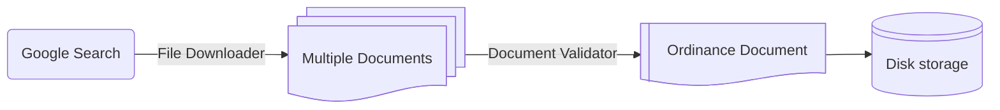

# **OrdinanceGPT: Architectural Design Document**

## **1. Introduction**
### **1.1 Purpose**
This document describes the architectural design of the ordinance web scraping and extraction tool, focusing on its components, key classes, and their roles within the system.

### **1.2 Audience**
- **Primary:** Model developers working on expanding the capabilities of ordinance extraction.
- **Secondary:** Model developers extending this functionality to other contexts.

### **1.3 Scope**
Covers the OrdinanceGPT design, including key classes, their responsibilities, and interactions.

---

## **2. High-Level Architecture**
### **2.1 System Context**
Points of interaction for OrdinanceGPT:
- **End Users:** Users submit model executions via command-line using a configuration file. Users can select specific jurisdictions to focus on.
- **Internet via Web Browser:** The model searches the web for relevant legal documents. The most common search technique is Google Search.
- **LLMs:** The model relies on LLMs (typically ChatGPT) to analyze web scraping results and subsequently extract information from documents.
- **Filesystem:** Stores output files in organized sub-directories and compiles ordinance information into a CSV.

**Diagram:**


---

## **3. Detailed Design**
### **3.1 Web Scraper**
The OrdinanceGPT Web Scraper consists of:
- **Google Search:** Searches Google using pre-determined queries.
- **File Downloader:** Converts Google Search results into documents (PDF or text).
- **Document Validators:** Filters out irrelevant documents.

**Diagram:**


### **3.2 Document Parser**
The OrdinanceGPT Document Parser consists of:
- **Text Cleaner:** Extract text from ordinance related to data of interest (i.e. wind turbine zoning).
- **Decision Tree:** One decision tree per ordinance value of interest to guide data extraction using LLMs.

**Diagram:**


---


## **4 Key Concepts and Classes**
### **4.1 Key Concept: Services**
Because OrdinanceGPT is so reliant on LLMs, one of the main design goals is to minimize the code
overhead incurred by querying the LLM API. In other words, we want to make it **as simple as possible**
to make an LLM query from _anywhere_ in the model code. Let's look at the code required to do a single
OpenAI query using the `openai` python wrapper:
```python
import os
from openai import OpenAI

def my_function():

    ...

    client = OpenAI(
        api_key=os.environ.get("OPENAI_API_KEY"),
        version=os.environ.get("OPENAI_VERSION"),
        endpoint=os.environ.get("OPENAI_ENDPOINT"),
    )

    chat_completion = client.chat.completions.create(
        messages=[{"role": "user", "content": "Say this is a test"}],
        model="gpt-4o",
    )

    if response is None:
        response_str = ""
    else:
        response_str = response.choices[0].message.content

    ...

if __name__ == "__main__":
    my_function()
```

Not bad! However, it's still _A LOT_ of boilerplate code every time you want to make query.
Moreover, you may want to do extra processing on the response every time a call is made (i.e.
convert it to JSON, track the number of tokens used, etc). One option is to refactor away
some of the logic into a separate function:


```python
import os
from openai import OpenAI

def count_token_use(response):
    ...

def parse_response_to_str(response):
    if response is None:
        return ""
    return response.choices[0].message.content

def call_openai(messages, model="gpt-4o"):
    client = OpenAI(
        api_key=os.environ.get("OPENAI_API_KEY"),
        version=os.environ.get("OPENAI_VERSION"),
        endpoint=os.environ.get("OPENAI_ENDPOINT"),
    )
    chat_completion = client.chat.completions.create(
        messages=messages, model=model
    )
    count_token_use(response)
    return parse_response_to_str(response)

def my_function():
    ...
    response_str = call_openai(
        messages=[{"role": "user", "content": "Say this is a test"}],
        model="gpt-4o"
    )
    ...

if __name__ == "__main__":
    my_function()
```

This is a lot closer to what we are looking for. However, all LLM deployments (that we know
of anyways!) have quotas and rate limits. It can be frustrating to run into an unexpected rate
limit error deep within our model logic, so we'd like to add a tracker for usage that
staggers the submission of our queries to stay within the pre-imposed rate limits.

To do this, we need to submit our LLM call to a _queue_ instead of to the API directly. Then,
a separate worker can simultaneously monitor the queue and track rolling token usage. If the
worker finds an item in the queue, it will submit the LLM call to the API as long as the rate
limit has not been reached. Otherwise, it will wait until the limit has been reset before
submitting an additional call.

This is the main concept behind _services_ in the ELM ordinance code. We call the worker a
`Service`, and it monitors a dedicated queue that we can submit to from _anywhere_ in our code
without having to worry about setting up usage monitors or other utility functions related to
the API call. To use the service, we simply have to invoke the `call` (class)method with the
relevant arguments. The only price we have to pay is that the service has to be _running_ (i.e.
actively monitoring a queue and tracking usage) when our function is called. In practice, the
code looks something like this (with `async` flavor now spread throughout):

```python
import asyncio
import openai
from elm.ords.services.provider import RunningAsyncServices
from elm.ords.services.openai import OpenAIService

async def my_function():
    # This function can be anywhere -
    # in a separate module or even in external code
    ...
    response_str = await OpenAIService.call(
        messages=[{"role": "user", "content": "Say this is a test"}],
        model="gpt-4o"
    )
    ...

async def main():
    client = openai.AsyncAzureOpenAI(
        api_key=os.environ.get("AZURE_OPENAI_API_KEY"),
        api_version=os.environ.get("AZURE_OPENAI_VERSION"),
        azure_endpoint=os.environ.get("AZURE_OPENAI_ENDPOINT")
    )
    openai_service = OpenAIService(
        client, rate_limit=1e4  # adjustable; counted in tokens per minute
    )
    async with RunningAsyncServices([openai_service]):
        await my_function()

if __name__ == "__main__":
    asyncio.run(main())
```

The cool thing is that if there are other functions in the model that use `OpenAIService.call`,
this method will track their usage as well (all calls are submitted to the same queue), so no
need to worry about exceeding limits when calling other methods! `OpenAIService` also provides
some additional features behind the scenes, such as automatic resubmission upon API failure and
ability to set up total token usage tracking.

#### **4.1.1 Threaded and Process Pool Services**
The ELM ordinance code takes the `Services` idea one step further. When running an `async` pipeline,
it can be beneficial to run some work on separate threads or even CPU cores. Since these are limited
resources, we can use `Services` to monitor their use as well! Let's look at a few examples:


```python
import asyncio
import openai
from elm.ords.services.provider import RunningAsyncServices
from elm.ords.services.openai import OpenAIService
from elm.ords.services.threaded import FileMover
from elm.ords.services.cpu import PDFLoader

async def read_pdf():
    # Loads a PDF file in a separate process (this can be time consuming if using OCR, for example)
    return PDFLoader.call(...)

async def my_function():
    ...
    response_str = await OpenAIService.call(
        messages=[{"role": "user", "content": "Say this is a test"}],
        model="gpt-4o"
    )
    ...
    FileMover.call(...) # Moves files to "./my_folder" using separate thread
    ...

async def main():
    client = openai.AsyncAzureOpenAI(
        api_key=os.environ.get("AZURE_OPENAI_API_KEY"),
        api_version=os.environ.get("AZURE_OPENAI_VERSION"),
        azure_endpoint=os.environ.get("AZURE_OPENAI_ENDPOINT")
    )
    services = [
        OpenAIService(client, rate_limit=1e4),  # OpenAI service, with rate monitoring as before
        FileMover(out_dir="./my_folder", max_workers=8),  # launches 8 threads, each of which can be used run individual jobs
        PDFLoader(max_workers=4),  # launches 4 processes, each of which can be used run individual jobs
    ]
    async with RunningAsyncServices(services):
        await read_pdf()
        await my_function()

if __name__ == "__main__":
    asyncio.run(main())
```

There are several other services provided out of the box - see the
[documentation](https://nrel.github.io/elm/_autosummary/elm.ords.services.html) for details
Alternatively, we provide two base classes that you can extend to get similar functionality:
[`ThreadedService`](https://nrel.github.io/elm/_autosummary/elm.ords.services.threaded.ThreadedService.html#elm.ords.services.threaded.ThreadedService)
for threaded tasks and
[`ProcessPoolService`](https://nrel.github.io/elm/_autosummary/elm.ords.services.cpu.ProcessPoolService.html#elm.ords.services.cpu.ProcessPoolService)
for multiprocessing tasks.

### **4.2 Key Classes**
#### **4.2.1 PlaywrightGoogleLinkSearch**
- **Purpose:** Search Google using Playwright engine.
- **Responsibilities:**
  1. Launch browser using Playwright and navigate to Google.
  2. Get list of result URLs.
- **Key Relationships:** Relies on [`Playwright`](https://playwright.dev/python/) for web access.
- **Example Code:**
    ```python
    from elm.web.google_search import PlaywrightGoogleLinkSearch

    async def main():
        search_engine = PlaywrightGoogleLinkSearch()
        return await search_engine.results(
            "Wind energy zoning ordinance Decatur County, Indiana",
            num_results=10,
        )

    if __name__ == "__main__":
        asyncio.run(main())
    ```

---

#### **4.2.2 AsyncFileLoader**
- **Purpose:** Save content from links as files.
- **Responsibilities:**
  1. Retrieve data from a URL.
  2. Determine wether information should be stored as a PDF or HTML document.
- **Key Relationships:** Returns either `PDFDocument` or `HTMLDocument`. Uses `aiohttp` to access the web.
- **Example Code:**
    ```python
    import asyncio
    from elm.web.file_loader import AsyncFileLoader

    async def main():
        loader = AsyncFileLoader()
        doc = await loader.fetch(
            url="https://en.wikipedia.org/wiki/National_Renewable_Energy_Laboratory"
        )
        return doc

    if __name__ == "__main__":
        asyncio.run(main())
    ```

---

#### **4.2.3 PDFDocument/HTMLDocument**
- **Purpose:** Track document content and perform minor processing on it.
- **Responsibilities:**
  1. Store "raw" document text.
  2. Compute "cleaned" text, which combines pages, strips HTML, and formats tables.
  3. Track pages and other document metadata.
- **Key Relationships:** Created by `AsyncFileLoader` and used all over ordinance code.
- **Example Code:**
    ```python
    from elm.web.document import HTMLDocument

    content = ...
    doc = HTMLDocument([content])
    doc.text, doc.raw_pages, doc.metadata
    ```

---

#### **4.2.4 OpenAIService**
- **Purpose:** Orchestrate OpenAI API calls.
- **Responsibilities:**
  1. Monitor OpenAI call queue.
  2. Submit calls to OpenAI API if rate limit has not been exceeded.
  3. Track token usage, both instantaneous (rate) and total (if user requests it).
  4. Parse responses into `str` and pass back to calling function.
- **Key Relationships:** Must be activated with `RunningAsyncServices` context.
- **Example Code:**
    ```python
    import asyncio
    import openai
    from elm.ords.services.provider import RunningAsyncServices
    from elm.ords.services.openai import OpenAIService

    async def main():
        client = openai.AsyncAzureOpenAI(
            api_key=os.environ.get("AZURE_OPENAI_API_KEY"),
            api_version=os.environ.get("AZURE_OPENAI_VERSION"),
            azure_endpoint=os.environ.get("AZURE_OPENAI_ENDPOINT")
        )
        service = OpenAIService(client, rate_limit=1e4)
        async with RunningAsyncServices([service]):
            response_str = await OpenAIService.call(
                messages=[{"role": "user", "content": "Say this is a test"}],
                model="gpt-4o"
            )
        return response_str

    if __name__ == "__main__":
        asyncio.run(main())
    ```

---

#### **4.2.5 LLMCaller/ChatLLMCaller/StructuredLLMCaller**
- **Purpose:** Helper classes to call LLMs.
- **Responsibilities:**
  1. Use a service (e.g. `OpenAIService`) to query an LLM.
  2. Maintain a useful context to simplify LLM query.
       - Typically these classes are initialized with a single LLM model (and optionally a usage tracker)
       - This context is passed to every `Service.call` invocation, allowing user to focus on only the message.
  3. Track message history (`ChatLLMCaller`) or convert output into JSON (`StructuredLLMCaller`).
- **Key Relationships:** Delegates most of work to underlying `Service` class.
- **Example Code:**
    ```python
    import asyncio
    import openai
    from elm.ords.services.provider import RunningAsyncServices
    from elm.ords.services.openai import OpenAIService
    from elm.ords.llm import StructuredLLMCaller

    CALLER = StructuredLLMCaller(
        llm_service=OpenAIService,
        model="gpt-4o",
        temperature=0,
        seed=42,
        timeout=30,
    )

    async def main():
        client = openai.AsyncAzureOpenAI(
            api_key=os.environ.get("AZURE_OPENAI_API_KEY"),
            api_version=os.environ.get("AZURE_OPENAI_VERSION"),
            azure_endpoint=os.environ.get("AZURE_OPENAI_ENDPOINT")
        )
        service = OpenAIService(client, rate_limit=1e4)

        async with RunningAsyncServices([service]):
            response_str = await CALLER.call(
                sys_msg="You are a helpful assistant",
                content="Say this is a test",
            )
        return response_str

    if __name__ == "__main__":
        asyncio.run(main())
    ```

---

#### **4.2.6 CountyValidator**
- **Purpose:** Determine wether a document pertains to a specific county.
- **Responsibilities:**
  1. Use a combination of heuristics and LLM queries to determine wether or not a document pertains to a particular county.
- **Key Relationships:** Uses a `StructuredLLMCaller` for LLM queries and delegates sub-validation to `CountyNameValidator`, `CountyJurisdictionValidator`, and `URLValidator`.
- **Example Code:**
    ```python
    import asyncio
    import openai
    from elm.ords.services.provider import RunningAsyncServices
    from elm.ords.services.openai import OpenAIService
    from elm.ords.llm import StructuredLLMCaller
    from elm.ords.validation.location import CountyValidator
    from elm.web.document import HTMLDocument

    CALLER = StructuredLLMCaller(
        llm_service=OpenAIService,
        model="gpt-4o",
        temperature=0,
        seed=42,
        timeout=30,
    )

    async def main():
        content = ...
        doc = HTMLDocument([content])

        client = openai.AsyncAzureOpenAI(
            api_key=os.environ.get("AZURE_OPENAI_API_KEY"),
            api_version=os.environ.get("AZURE_OPENAI_VERSION"),
            azure_endpoint=os.environ.get("AZURE_OPENAI_ENDPOINT")
        )
        service = OpenAIService(client, rate_limit=1e4)
        validator =  CountyValidator(CALLER)

        async with RunningAsyncServices([service]):
            is_valid = await validator.check(
                doc, county="Decatur", state="Indiana"
            )

        return is_valid

    if __name__ == "__main__":
        asyncio.run(main())
    ```

---

#### **4.2.7 OrdinanceValidator**
- **Purpose:** Determine wether a document contains relevant ordinance information.
- **Responsibilities:**
  1. Determine wether a document contains relevant (e.g. utility-scale wind zoning) ordinance information by splitting the text into chunks and parsing them individually using LLMs.
- **Key Relationships:** Child class of `ValidationWithMemory`, which allows the validation to look at neighboring chunks of text.
- **Example Code:**
    ```python
    import asyncio
    import openai
    from langchain.text_splitter import RecursiveCharacterTextSplitter
    from elm.ords.extraction.ordinance import OrdinanceValidator
    from elm.ords.services.provider import RunningAsyncServices
    from elm.ords.services.openai import OpenAIService
    from elm.ords.llm import StructuredLLMCaller
    from elm.web.document import HTMLDocument

    CALLER = StructuredLLMCaller(
        llm_service=OpenAIService,
        model="gpt-4o",
        temperature=0,
        seed=42,
        timeout=30,
    )
    TEXT_SPLITTER = RecursiveCharacterTextSplitter(...)

    async def main():
        content = ...
        doc = HTMLDocument([content])

        client = openai.AsyncAzureOpenAI(
            api_key=os.environ.get("AZURE_OPENAI_API_KEY"),
            api_version=os.environ.get("AZURE_OPENAI_VERSION"),
            azure_endpoint=os.environ.get("AZURE_OPENAI_ENDPOINT")
        )
        service = OpenAIService(client, rate_limit=1e4)
        chunks = TEXT_SPLITTER.split_text(doc.text)
        validator = OrdinanceValidator(CALLER, chunks)

        async with RunningAsyncServices([service]):
            contains_ordinances = await validator.parse()
            text = validator.ordinance_text

        return contains_ordinances, text

    if __name__ == "__main__":
        asyncio.run(main())
    ```

---

#### **4.2.8 OrdinanceExtractor**
- **Purpose:** Extract relevant ordinance text from document.
- **Responsibilities:**
  1. Extract portions from chunked document text relevant to particular ordinance type (e.g. wind zoning for utility-scale systems).
- **Key Relationships:** Uses a `StructuredLLMCaller` for LLM queries.
- **Example Code:**
    ```python
    import asyncio
    import openai
    from langchain.text_splitter import RecursiveCharacterTextSplitter
    from elm.ords.extraction.ordinance import OrdinanceExtractor
    from elm.ords.services.provider import RunningAsyncServices
    from elm.ords.services.openai import OpenAIService
    from elm.ords.llm import StructuredLLMCaller

    CALLER = StructuredLLMCaller(
        llm_service=OpenAIService,
        model="gpt-4o",
        temperature=0,
        seed=42,
        timeout=30,
    )
    TEXT_SPLITTER = RecursiveCharacterTextSplitter(...)

    async def main():
        content = ...

        client = openai.AsyncAzureOpenAI(
            api_key=os.environ.get("AZURE_OPENAI_API_KEY"),
            api_version=os.environ.get("AZURE_OPENAI_VERSION"),
            azure_endpoint=os.environ.get("AZURE_OPENAI_ENDPOINT")
        )
        service = OpenAIService(client, rate_limit=1e4)
        validator = OrdinanceExtractor(CALLER)

        async with RunningAsyncServices([service]):
            text_chunks = TEXT_SPLITTER.split_text(content)
            ordinance_text = await extractor.check_for_restrictions(text_chunks)

            text_chunks = text_splitter.split_text(ordinance_text)
            ordinance_text = await TEXT_SPLITTER extractor.check_for_correct_size(text_chunks)

        return ordinance_text

    if __name__ == "__main__":
        asyncio.run(main())
    ```

---

#### **4.2.9 AsyncDecisionTree**
- **Purpose:** Represent a series of prompts that can be used in sequence to extract values of interest from text.
- **Responsibilities:**
  1. Store all prompts used to extract a particular ordinance value from text.
  2. Track relationships between the prompts (i.e. which prompts is used first, which prompt is used next depending on the output of the previous prompt, etc.) using a directed acyclic graph.
- **Key Relationships:** Inherits from `DecisionTree` to add `async` capabilities. Uses a `ChatLLMCaller` for LLm queries.
- **Example Code:**
    ```python
    import asyncio
    import openai
    from elm.ords.services.provider import RunningAsyncServices
    from elm.ords.services.openai import OpenAIService


    async def main():
        client = openai.AsyncAzureOpenAI(
            api_key=os.environ.get("AZURE_OPENAI_API_KEY"),
            api_version=os.environ.get("AZURE_OPENAI_VERSION"),
            azure_endpoint=os.environ.get("AZURE_OPENAI_ENDPOINT")
        )
        service = OpenAIService(client, rate_limit=1e4)

        G = ... # graph with prompts and a `ChatLLMCaller` instance embedded
        tree = AsyncDecisionTree(G)

        async with RunningAsyncServices([service]):
            response = await tree.async_run()

        return response

    if __name__ == "__main__":
        asyncio.run(main())
    ```

---

#### **4.2.10 StructuredOrdinanceParser**
- **Purpose:** Extract structured ordinance data from text.
- **Responsibilities:**
  1. Extract ordinance values into structured format by executing a decision-tree-based chain-of-thought prompt on the text for each value to be extracted.
- **Key Relationships:** Uses a `StructuredLLMCaller` for LLM queries and multiple `AsyncDecisionTree` instances to guide the extraction of individual values.
- **Example Code:**
    ```python
    import asyncio
    import openai
    from elm.ords.extraction.parse import StructuredOrdinanceParser
    from elm.ords.services.provider import RunningAsyncServices
    from elm.ords.services.openai import OpenAIService
    from elm.ords.llm import StructuredLLMCaller

    CALLER = StructuredLLMCaller(
        llm_service=OpenAIService,
        model="gpt-4o",
        temperature=0,
        seed=42,
        timeout=30,
    )

    async def main():
        content = ...

        client = openai.AsyncAzureOpenAI(
            api_key=os.environ.get("AZURE_OPENAI_API_KEY"),
            api_version=os.environ.get("AZURE_OPENAI_VERSION"),
            azure_endpoint=os.environ.get("AZURE_OPENAI_ENDPOINT")
        )
        service = OpenAIService(client, rate_limit=1e4)
        parser = StructuredOrdinanceParser(CALLER)

        async with RunningAsyncServices([service]):
            ordinance_values = await parser.parse(content)

        return ordinance_values

    if __name__ == "__main__":
        asyncio.run(main())
    ```

---

## **5. Workflows**
### **5.1 Downloading documents from Google**
We give a basic demonstration of the following call:
```python
import asyncio
from elm.web.google_search import google_results_as_docs

QUERIES = [
    "NREL wiki",
    "National Renewable Energy Laboratory director",
    "NREL leadership wikipedia",
]

async def main():
    docs = await google_results_as_docs(QUERIES, num_urls=4)
    return docs

if __name__ == "__main__":
    asyncio.run(main())
```
**Step-by-Step:**
1. `google_results_as_docs()` is invoked with 3 queries and `num_urls=4`.
2. Each of the three queries are processed asynchronously, creating a `PlaywrightGoogleLinkSearch` instance and retrieving the top URL results.
3. Internal code reduces the URL lists returned from each of the queries into the top 4 URLs.
4. `AsyncFileLoader` asynchronously downloads the content for reach of the top 4 URLs, determines the document type the content should be stored in (`HTMLDocument` or `PDFDocument`), creates and populates the document instances, and returns the document to the caller.

**Sequence Diagram:**


Note that the interleaved call-and-response pairs are meant to exhibit the `async` nature of the process and do not reflect a deterministic execution order.

---

## **6. Appendix**
### **6.1 Tools and Libraries**
- **aiohttp/beautifulsoup4:** For fetching content from the web.
- **html2text:** For utilities to pull text from HTML.
- **langchain:** For utility classes like `RecursiveCharacterTextSplitter`.
- **networkx:** For representing the DAG behind the decision tree(s).
- **pdftotext:** For robust pdf to text conversion using poppler.
- **playwright:** For navigating the web and performing Google searches.
- **PyPDF2:** For auxiliary pdf utilities.
- **pytesseract (optional):** For OCR utilities to read scanned pdf files.
- **tiktoken:** For counting the number of LLM tokens used by a query.

---

### Deliverables
This document can serve as a foundational guide for developers and analysis.
It helps users of this code understand the software's design and allows for
smoother onboarding and more informed project planning.
